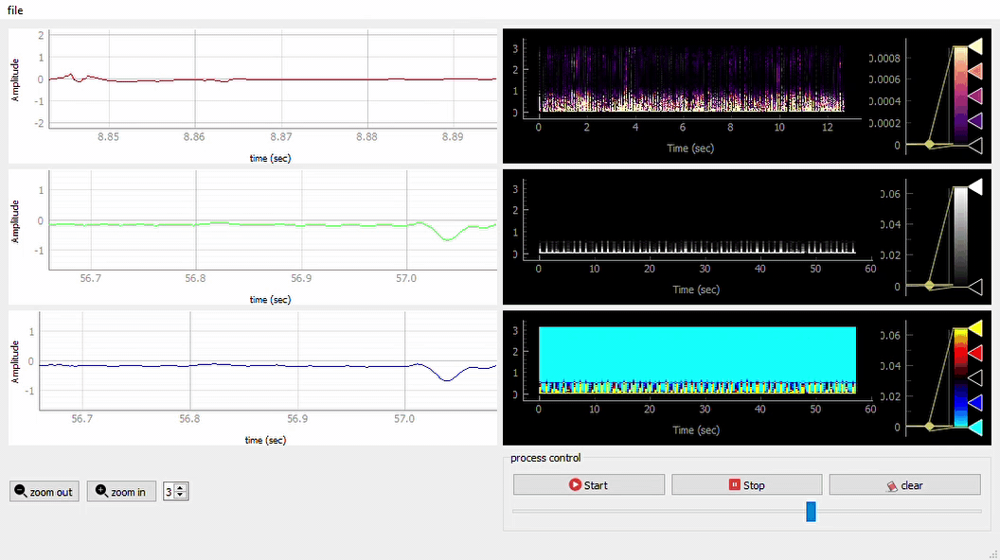

# biosignal-viewer

## About

> desktop application for viewing signal files with various extensions with the ability of zooming, pausing and resuming the dynamic view, uploading multiple channels to view at the same time, it can also save the signals viewed as figures in pdf file, each signal is saved associated with it's own full spectrogram.

  

